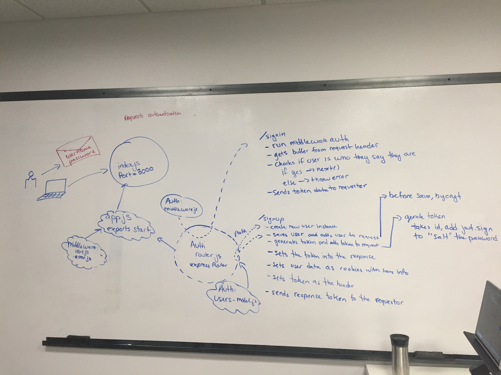

 LAB
=================================================

## Project Name: Authentication

### Author:  Hannah Ingham, Jared Pattison

### Links and Resources
* [repo](https://github.com/jaredpattison/16)
* [travis](https://www.travis-ci.com/jaredpattison/16)]
* [back-end](https://j-h-16.herokuapp.com/)

### Modules
#### `middleware.js` `router.js` `user-models.js` `middleware.js`
##### Middleware: 404.js error.js

###### Usage Notes or examples
signup:
http post :4000/signup username:password

signin
http post :4000/signin -a username:password

show books

http get :4000/books -a username:password

### Setup
#### `.env` requirements
* `PORT` - running on 3000
* `MONGODB_URI` - mongodb://localhost:27017/users

#### Running the app
* `npm start`
* Endpoint: `/signup`
  * Returns a user encrypted token
* Endpoint: `/signin`
  * Returns a user encrypted token
* Endpoing: `/books`
  * Returns a list of books

  
#### Tests
* How do you run tests?
    * runs tests using super goose
    * npm test
* What assertions were made?
    * asserts that a new user can be created
    * asserts that users users signed in can see books
    * login in a user with correct creditials
    * fails to login user with incorrect credentials

#### UML

